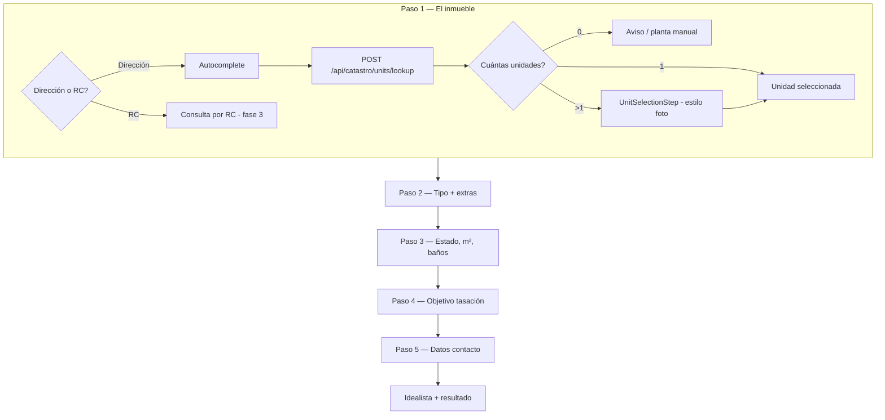

# how-much-is-this-property-worth

## Quick start

```bash
make install
make db
make dev
```

- API: http://localhost:8001  
- UI: http://localhost:5173  

See [docs/structure.md](docs/structure.md) for folder layout, env files, and what to ignore at the repo root.

**Deploy:** [docs/deployment.md](docs/deployment.md) — VPS único (~€5/mes): Docker + Caddy + SQLite.

## Project Description

`how-much-is-this-property-worth` is a residential property valuation tool focused on sale price estimation. The goal is to estimate what a property is worth today based on market evidence in the surrounding area, answering a simple owner question: **"How much is this property worth, and how much could I sell it for today?"**

The core flow starts from the property address. From that location, the system looks for comparable properties, recent transactions, and local market signals to calculate a current sale price estimate using nearby references and similar asset characteristics.

## Valuation flow (Fotocasa-style)

The wizard identifies the exact property first (via the Spanish **Catastro**), then collects characteristics, then runs the Idealista-based estimate.



| Step | UI label | What happens |
|------|----------|----------------|
| 1 | El inmueble | Address autocomplete → Catastro lookup → pick floor/door if needed |
| 2 | Características | Property type (casa/piso) and extras (pool, terrace, …) |
| 3 | Detalles | Condition, m², bedrooms, bathrooms |
| 4 | Objetivo | Why you need the valuation (sell / buy / rent / info); extra fields if selling |
| 5 | Tus datos | Name, email, phone → then scrape + estimated price |

**Catastro API:** free public service `Consulta_DNPLOC` ([docs](https://ovc.catastro.meh.es/ovcservweb/OVCSWLocalizacionRC/OVCCallejero.asmx?op=Consulta_DNPLOC)). Backend: `GET /api/catastro/units`, `POST /api/catastro/units/lookup`.

## How It Works

The user enters the property address and the system:

1. identifies the property's location and cadastral unit (when available);
2. finds nearby comparables;
3. filters them by relevant characteristics such as square meters, bedrooms, and bathrooms;
4. combines comparable listings with recent closings and local market behavior;
5. generates an estimated current sale price.

## Valuation Logic

The valuation is based on geographic comparables and transactions. The geographic reference can be defined using:

- a radius around the property;
- a census tract;
- and, if broader coverage is needed, larger areas such as district or municipality.

The product should always prioritize the closest relevant geography possible so the estimate reflects the real market for that specific property.

The valuation model is designed as a combination of:

- comparable properties in the same micro-market;
- recent closing transactions;
- the gap between asking price and closing price, used as a negotiation margin signal;
- and time-to-sell behavior by product type.

This means the estimate should not rely only on listed prices, but also on how the market is actually closing and how quickly similar properties are selling.

## Planned Outputs

Beyond the core valuation, the product direction also includes structured outputs such as:

- sale and rental reports;
- downloadable charts in `PNG` and `JPG`;
- CSV export with the underlying data;
- AI-generated reports;
- commercial API reports;
- and local broker intelligence, such as the top brokers in a given area and how many properties they have sold there.

## Product Roadmap

### Current Phase

Sale price estimation: how much a property could be sold for today, based on nearby comparables, recent transactions, negotiation margin signals, and local selling velocity.

### Phase 1

Rental estimation: how much the property could be rented for today.

### Phase 2

Potential return estimation, adding extra inputs such as:

- purchase price;
- transfer tax (`ITP`);
- other relevant transaction costs.
